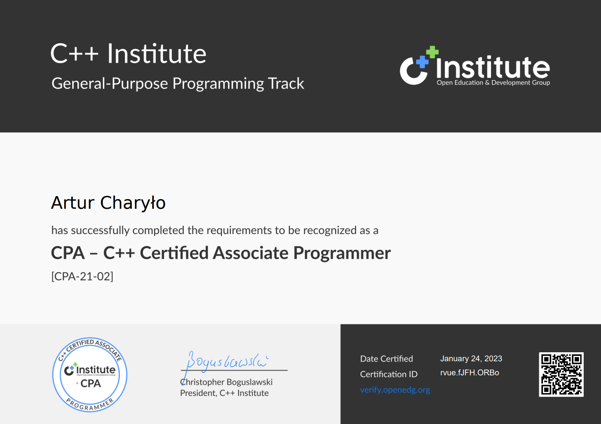

# 👋 Hi, I'm Artur Charyło

🎓 **Junior Backend Developer** based in Szczecin, Poland  
Passionate about building robust web applications and REST APIs.

📌 **Internship experience**

> Deployed GitLab & JIRA servers with Docker, integrated LDAP authentication,  
> configured CI/CD pipelines, implemented monitoring & backup strategies,  
> and delivered team training & full technical documentation.

🎓 **Education**

- Technical School SCI (IT Technician, bilingual program) — 2020–2025
- Ongoing: BSc in Computer Science, West Pomeranian University of Technology (ZUT) (from Oct 2025)
  
### 🏆 Certificate

  

🚀 **About me**

- 🎓 IT technician with internship experience in DevOps and system setup
- 💻 Strong background in Python, Node.js and React (TS/JS)
- 🌱 Keen to expand my tech stack and learn new technologies
- 🔍 Looking for opportunities as a backend or full-stack developer (remote or on-site)

💡 **Tech stack**

- 🖥️ **Backend:** Python, Django, FastAPI, Node.js, Express
- 🖥️ **Frontend:** React (TypeScript, JavaScript)
- 🗄️ **Databases:** PostgreSQL, Firebase
- ⚙️ **DevOps & Tools:** Docker, Git, GitLab CI/CD, JIRA, LDAP

🌟 **Highlighted projects**

- [ToDo_python](https://github.com/ArturCharylo/ToDo_python) – Python ToDo app with console, desktop & web interface connected to Django REST backend
- [Pet_feeder](https://github.com/ArturCharylo/Pet_feeder) / [Live version](https://pet-feeder-five.vercel.app) - Serverless PWA for tracking pet feeding schedules, with offline support and local notifications

### 📊 GitHub Stats

🚀 **Currently learning**

- Advanced Python (unit testing, design patterns, data analysing)
- deployment and Automation(CI/CD)
- Dart and Flutter

🌍 **Languages**

- Polish (native)
- English (fluent, C1/C2)

📫 **Contact**

- Email: [artur.cha@outlook.com](mailto:artur.cha@outlook.com)
- 🔗 [My LinkedIn](https://www.linkedin.com/in/artur-charyło-9554a1373/)
- Location: Szczecin, Poland (open to remote & stationary work)

---

⭐ _Feel free to explore my repositories below!_

<!--
**ArturCharylo/ArturCharylo** is a ✨ _special_ ✨ repository because its `README.md` (this file) appears on your GitHub profile.

Here are some ideas to get you started:

- 🔭 I’m currently working on ...
- 🌱 I’m currently learning ...
- 👯 I’m looking to collaborate on ...
- 🤔 I’m looking for help with ...
- 💬 Ask me about ...
- 📫 How to reach me: ...
- 😄 Pronouns: ...
- ⚡ Fun fact: ...
-->
