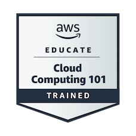

# 👋 Hi, I'm Artur Charyło

🎓 **Junior Fullstack Developer & Aspiring Cloud Engineer** based in Szczecin, Poland  
Passionate about building robust web applications, REST APIs, and Open Source tools, with a growing focus on cloud infrastructure.  
Want to explore my portfolio webpage? [Click here](https://artur-cha.vercel.app/)

📌 **Leadership & Experience**

> **President @ [AppCraft Student Organization](https://www.wi.zut.edu.pl/pl/dla-studenta/sprawy-studenckie/kola-naukowe/appcraft)** (2025 – Present)  
> Managing the organization, coordinating student-led software projects, and fostering a collaborative learning environment for aspiring developers.

> **Team Leader @ Enactus ZUT** (2025 – Present)  
> Formed and led the **first-ever** student team from the West Pomeranian voivodeship to compete in the Enactus National Competition. Managing project development, team alignment, and driving social-enterprise initiatives.

🖥️ **Internship Experience**
> Deployed GitLab & JIRA servers with Docker, integrated LDAP authentication,  
> configured CI/CD pipelines, implemented monitoring & backup strategies,  
> and delivered team training & full technical documentation.

🎓 **Education**

- **Technical School SCI** (IT Technician, bilingual program) — 2020–2025
- **B.Sc. in Computer Science**, West Pomeranian University of Technology (ZUT) — 2025–Present (Spec. Cloud Engineering)
  
### 🏆 Certificates & Badges

  
  

🚀 **About me**

- 🎓 IT Technician with hands-on experience in DevOps, Linux administration, and CI/CD environments.
- 💻 Strong background in TypeScript, Node.js, Python, and modern Web APIs.
- 📦 **NPM Package Author** & Active Open Source Contributor.
- 🦀 Experience in combining Rust & WebAssembly for high-performance web solutions.
- ☁️ Actively shifting towards Cloud Engineering, focusing on scalable infrastructure and automation.
- 🔍 Looking for Backend, DevOps, or Cloud-focused roles (Remote or On-site).

💡 **Tech stack**

- 🖥️ **Backend & Core:** Python (Django, FastAPI), Node.js, Rust, C++, WebAssembly (WASM), Ruby
- 🖥️ **Frontend:** React (TypeScript, JavaScript), Vite, Vue
- 🗄️ **Databases:** PostgreSQL, Firebase, Supabase
- ⚙️ **DevOps & Cloud:** Docker, Git, GitLab CI/CD, JIRA, LDAP, NPM Publishing

🌟 **Highlighted projects**

- 📦 **[argon2-extension-mv3](https://github.com/ArturCharylo/argon2-extension-mv3)** 
  - **NPM Library:** Secure, WebAssembly-based Argon2id implementation compatible with Chrome Extension Manifest V3.
  - Solves critical Content Security Policy (CSP) issues by eliminating `unsafe-eval` in WASM glue code.

- 🔐 **[Cryptono](https://github.com/ArturCharylo/Cryptono)**
  - A Chrome Extension password manager built with Vite + Vanilla TS + WASM (Rust & C++), focused on high security and clean architecture.
  - Powered by my own `argon2-extension-mv3` library for secure client-side encryption.
  - Features data compression and decompression on import/export achieved with the Brotli algorithm written in **Rust** and compiled into **WASM**.

- 🤖 **[quote-cli (Open Source Contribution)](https://github.com/ArturCharylo/quote-cli)**
  - Active contributor to an open-source CLI tool.
  - Implemented a scalable, multi-provider AI agent architecture using OOP patterns in TypeScript.
  - Added seamless integration support for OpenAI, Anthropic, and GitHub Copilot APIs.

- 📅 **[keep-my-plans](https://github.com/ArturCharylo/keep-my-plans)** — _[Live Demo](https://keep-my-plans.vercel.app)_
  - **Plan & Content Organizer:** A collaborative web application designed to organize personal plans, media recommendations, and shared lists.
  - Features dynamic, unlimited grouping structures to maintain clean, scalable categorization of user data.
  - Built with a clean UI/UX focus to simplify media sharing and link preservation between groups of friends.
    
- 📝 **[ToDo_python](https://github.com/ArturCharylo/ToDo_python)**
  - A decoupled full-stack ecosystem demonstrating client-server architecture.
  - Features a Django REST Framework backend serving three different clients: React Web App, Python Desktop GUI, and a CLI application.

### 📊 GitHub Stats

🚀 **Currently learning**

- 🏗️ **Cloud Engineering & IaC:** Diving deep into cloud infrastructure (AWS), Infrastructure as Code (Terraform), and microservices orchestration.
- 🏛️ **Software Architecture:** Focusing on scalable architecture, Design Patterns (OOP, DDD), effective refactoring, and comprehensive Unit Testing.
- 🦀 **Rust:** Deepening knowledge of memory safety, performance optimization, and advanced WebAssembly integrations.
- 📱 **Mobile Development:** Building cross-platform applications with Dart and Flutter.
  
🌍 **Languages**

- Polish (Native)
- English (Fluent, C1/C2)

📫 **Contact**

- Email: [artur.charylo@gmail.com](mailto:artur.charylo@gmail.com)
- 🔗 [My LinkedIn](https://www.linkedin.com/in/artur-chary%C5%82o-9554a1373/)
- Location: Szczecin, Poland (Open to remote & hybrid/stationary work)

---

⭐ _Feel free to explore my repositories below!_
