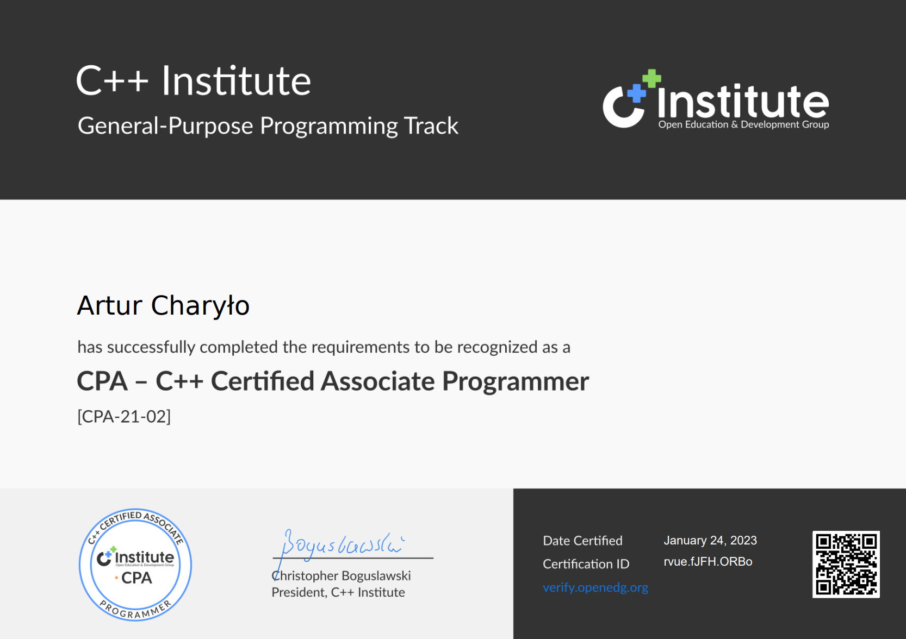

# 👋 Hi, I'm Artur Charyło

🎓 **Junior Fullstack Developer** based in Szczecin, Poland  
Passionate about building robust web applications, REST APIs, and Open Source tools.  
Want to explore my portfolio webpage? [click here](https://portfolio-two-ashen-r194kayj1q.vercel.app/)

📌 **Internship experience**

> Deployed GitLab & JIRA servers with Docker, integrated LDAP authentication,  
> configured CI/CD pipelines, implemented monitoring & backup strategies,  
> and delivered team training & full technical documentation.

🎓 **Education**

- Technical School SCI (IT Technician, bilingual program) — 2020–2025
- Ongoing: BSc in Computer Science, West Pomeranian University of Technology (ZUT) (from Oct 2025)
  
### 🏆 Certificate

  

🚀 **About me**

- 🎓 IT technician with internship experience in DevOps and system setup
- 💻 Strong background in TypeScript, Node.js, Python, and modern Web APIs
- 📦 **NPM Package Author** & Active Open Source Contributor
- 🦀 Experience in combining Rust & WebAssembly for high-performance web solutions
- 🌱 Keen to expand my tech stack and tackle complex engineering problems
- 🔍 Looking for opportunities as a backend or full-stack developer (remote or on-site)

💡 **Tech stack**

- 🖥️ **Backend & Core:** Python (Django, FastAPI), Node.js, Rust, C++, WebAssembly (WASM)
- 🖥️ **Frontend:** React (TypeScript, JavaScript), Vite
- 🗄️ **Databases:** PostgreSQL, Firebase, Supabase
- ⚙️ **DevOps & Tools:** Docker, Git, GitLab CI/CD, JIRA, LDAP, NPM Publishing

🌟 **Highlighted projects**

- 📦 **[argon2-extension-mv3](https://github.com/ArturCharylo/argon2-extension-mv3)** 
  - **NPM Library:** Secure, WebAssembly-based Argon2id implementation compatible with Chrome Extension Manifest V3.
  - Solves critical Content Security Policy (CSP) issues by eliminating `unsafe-eval` in WASM glue code.

- 🔐 **[Cryptono](https://github.com/ArturCharylo/Cryptono)**
  - Password manager built as a Chrome Extension (Vite + Vanilla TS) focused on high security and clean architecture.
  - Powered by my own `argon2-extension-mv3` library for secure client-side encryption.
  - Features data compression and decompression on import/export achieved with the Brotli algorithm written in **Rust** and compiled into **WASM**.

- 🤖 **[quote-cli (Open Source Contribution)](https://github.com/ArturCharylo/quote-cli)**
  - Active contributor to an open-source CLI tool.
  - Implemented a scalable, multi-provider AI agent architecture using OOP patterns in TypeScript.
  - Added seamless integration support for OpenAI, Anthropic, and GitHub Copilot APIs.

- 📝 **[ToDo_python](https://github.com/ArturCharylo/ToDo_python)**
  - A decoupled full-stack ecosystem demonstrating client-server architecture.
  - Features a Django REST Framework backend serving three different clients: React Web App, Python Desktop GUI, and a CLI application.

### 📊 GitHub Stats

🚀 **Currently learning**

- 🏗️ **Software Architecture & Clean Code:** Focusing on scalable code structure, Design Patterns (OOP, DDD), effective refactoring, and comprehensive Unit Testing (Python & TypeScript).
- 🦀 **Rust:** Deepening knowledge of memory safety, performance optimization, and advanced WebAssembly integrations.
- 📱 **Mobile Development:** Building cross-platform applications with Dart and Flutter.
  
🌍 **Languages**

- Polish (native)
- English (fluent, C1/C2)

📫 **Contact**

- Email: [artur.cha@outlook.com](mailto:artur.cha@outlook.com)
- 🔗 [My LinkedIn](https://www.linkedin.com/in/artur-charyło-9554a1373/)
- Location: Szczecin, Poland (open to remote & stationary work)

---

⭐ _Feel free to explore my repositories below!_
