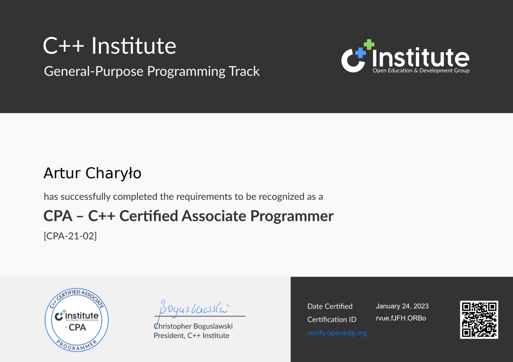
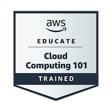
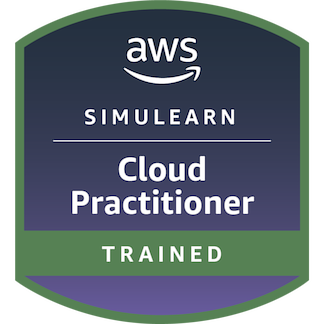

# 👋 Hi, I'm Artur Charyło

🎓 **Junior Cloud/DevOps & Software Engineer** based in Szczecin, Poland  
Specializing in automated delivery pipelines, Kubernetes orchestration, and supply-chain security (EU CRA compliance, automated CVE gates). I bridge Infrastructure as Code (Terraform, Azure/AWS) with high-efficiency backend services.

🔗 [Explore my Portfolio](https://artur-cha.vercel.app/) • [LinkedIn](https://www.linkedin.com/in/artur-charylo)

---

### 🚀 About Me

- ☁️ **Cloud & DevOps Focus:** Hands-on experience with Kubernetes, Terraform IaC, multi-cloud (Azure, AWS), and enterprise DevSecOps pipelines.
- 🦀 **Systems & Performance:** Building low-level modules, telemetry engines, and WebAssembly integrations with Rust and C++.
- 📦 **Open Source & Author:** Published [`argon2-extension-mv3`](https://www.npmjs.com/package/argon2-extension-mv3) on npm; active open-source contributor.
- 🎓 **Academic & Leadership:** Computer Science undergraduate (Cloud Engineering spec.) at ZUT; President of APPCRAFT Student Organization and Enactus Team Leader.
- 🔍 **Open to Roles:** Cloud, DevOps, or Backend Engineering (Remote, Hybrid, or On-site).

---

### 💡 Tech Stack

- ⚙️ **Cloud & DevOps:** Docker, Kubernetes (Kind, Helm), Terraform, Azure DevOps, GitLab CI/CD, ArgoCD, Linux, AWS, Azure Cloud
- 🛡️ **DevSecOps & Observability:** Trivy, CycloneDX SBOM, Cosign, Azure Key Vault, Prometheus, Grafana
- 🖥️ **Backend & Systems:** Rust, C++, WebAssembly (WASM), Python (FastAPI, Django), Node.js / TypeScript
- 🗄️ **Databases & Tools:** PostgreSQL, Supabase, Git, NGINX

---

### 📌 Leadership & Experience

> **President @ [AppCraft Student Organization](https://www.wi.zut.edu.pl/pl/dla-studenta/sprawy-studenckie/kola-naukowe/appcraft)** (2025 – Present)  
> Managing the organization, coordinating student-led software projects, and fostering a collaborative technical community for aspiring developers.

> **Team Leader @ Enactus ZUT** (2025 – Present)  
> Formed and led the **first-ever** student team from West Pomerania to compete in the Enactus National Competition. Directing project architecture and cross-functional team execution.

---

### 🖥️ Internship Experience

> **DevOps Intern @ Kongsberg Maritime Poland** (Sep 2026)  
> - Designed and deployed Kubernetes environments (Kind & Helm) featuring automated HPA scaling, cAdvisor, and NGINX Ingress routing.
> - Built multi-stage Azure DevOps CI/CD pipelines enforcing automated DevSecOps gates (Trivy `CRITICAL = 0` policy for PROD), SBOM CycloneDX generation, and gated image delivery to Dev/Prod ACR.
> - Automated artifact and container signing workflows utilizing Cosign and intermediate TLS certificates backed by Azure Key Vault.
> - Engineered an observability pipeline pushing Trivy & SBOM metrics via Prometheus Pushgateway to Grafana, configuring multi-channel alerts and custom dashboards.
> - Authored reusable Azure DevOps YAML pipeline templates for C++/CMake services automating building, Trivy security scanning, unit testing, code coverage publishing, and binary artifact distribution.

> **DevOps Intern @ SCI** (2023)  
> - Deployed on-premise GitLab and Jira servers using Docker and Linux, integrating LDAP directory authentication.  
> - Configured CI/CD pipeline triggers and implemented automated backup and disaster-recovery strategies.  
> - Delivered team training and maintained comprehensive technical documentation.

---

## 🌟 Highlighted Projects

- 🛡️ **[kongsberg-devops-pipeline](https://github.com/ArturCharylo/kongsberg)**
  - **EU CRA-Compliant DevSecOps & Supply Chain Security:** Enterprise-grade Azure DevOps CI/CD pipeline featuring automated vulnerability gates (`CRITICAL = 0`), CycloneDX SBOM generation, and cryptographic signing with Cosign & Azure Key Vault.
  - **Kubernetes & Cloud Observability:** Multi-environment deployments via Helm to local Kind clusters with HPA autoscaling, NGINX Ingress, and HTTPS termination; integrated Prometheus Pushgateway to stream CVE and SBOM metrics directly into Grafana alert dashboards.

- 🚗 **[CarCanSim](https://github.com/ArturCharylo/CarCanSim)**
  - **Cloud-Native Telemetry Engine & GitOps Infrastructure:** High-performance OBD-II/CAN simulation built with **Rust**, containerized with Docker, and deployed via a hybrid cloud model.
  - **Multi-Stage CI/CD & Cloud Deployment:** Automated Azure DevOps YAML pipeline deploying serverless revisions to **Azure Container Apps (ACA)** and **Azure Container Registry (ACR)** via **Terraform IaC**, optimized with non-interactive Service Principal auth and scale-to-zero ($0 baseline).
  - **Local Kubernetes & GitOps:** Configured on local **Kind** with **ArgoCD**, **NGINX Ingress**, and end-to-end observability powered by **Prometheus** and **Grafana** (`/metrics` scraping).

- 🔐 **[Cryptono](https://github.com/ArturCharylo/Cryptono)**
  - A Chrome Extension password manager built with Vite + Vanilla TS + WASM (Rust & C++), focused on high security and clean architecture.
  - Powered by my own `argon2-extension-mv3` library for secure client-side encryption.
  - Features data compression and decompression on import/export achieved with the Brotli algorithm written in **Rust** and compiled into **WASM**.

- 📦 **[argon2-extension-mv3](https://github.com/ArturCharylo/argon2-extension-mv3)** 
  - **NPM Library:** Secure, WebAssembly-based Argon2id implementation compatible with Chrome Extension Manifest V3.
  - Solves critical Content Security Policy (CSP) issues by eliminating `unsafe-eval` in WASM glue code.

- 🤖 **[quote-cli (Open Source Contribution)](https://github.com/ArturCharylo/quote-cli)**
  - Active contributor to an open-source CLI tool.
  - Implemented a scalable, multi-provider AI agent architecture using OOP patterns in TypeScript.
  - Added seamless integration support for OpenAI, Anthropic, and GitHub Copilot APIs.

---

### 🎓 Education & Certifications

- **B.Sc. in Computer Science**, West Pomeranian University of Technology (ZUT) — 2025–Present (Spec. Cloud Engineering)
- **Technical School SCI** (IT Technician, bilingual program) — 2020–2025

  
  
  

---

### 📊 GitHub Stats

 
 

### 📫 Contact

- **Email:** [artur.charylo@gmail.com](mailto:artur.charylo@gmail.com)
- **LinkedIn:** [linkedin.com/in/artur-charylo](https://www.linkedin.com/in/artur-charylo)
- **Location:** Szczecin, Poland (Open to Remote / Hybrid / On-site)
